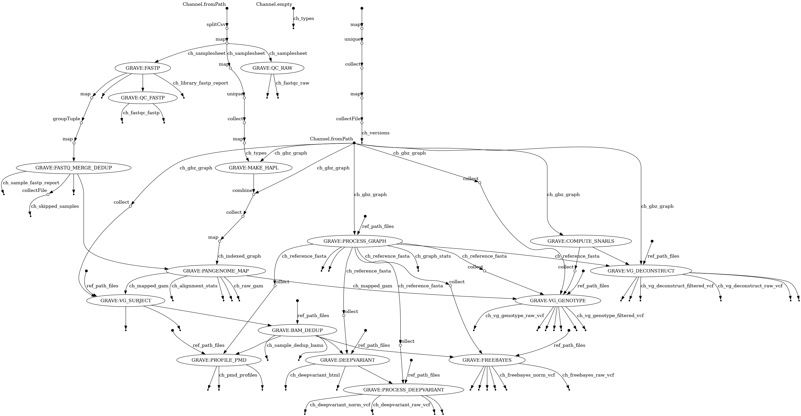

[](https://pixi.sh)

# Grave

**Graph Variant Explorer: Pangenomic analysis of ancient or modern DNA**

## Description

`grave` is a Nextflow workflow for mapping and genotyping ancient or modern samples against a pangenome graph. The steps are shown [here](#pipeline-overview).

As input it takes a pangenome graph in `.gbz` format and either paired-end or merged FASTQ data (from samples listed in a `.csv` samplesheet).

It is recommended to construct the graph with [Minigraph-Cactus](https://github.com/ComparativeGenomicsToolkit/cactus/blob/master/doc/pangenome.md). Before doing so, read this [section](#input-fasta-naming).

## Quick start

[](https://gitpod.io/#https://github.com/NBISweden/grave)

### Local or HPC installation

1. [Install Pixi](https://pixi.sh/latest/)
2. Clone the Workflow repository: `git clone https://github.com/NBISweden/grave.git`
3. Run `pixi install`

### Run grave with test data

Run with the provided test data: `pixi run grave-test`

### Run grave with your data

1. [Input file setup](#file-setup)
2. Run with custom parameters, e.g.: `pixi run nextflow main.nf --graphMode filter --account naiss2049-87-324 -profile dardelSlurm`

>[!TIP]
>For help with command line options: `pixi run help`

>[!TIP]
>An example shell script for running `grave` on a cluster with SLURM is provided in the repo

### File setup

1. Add the [graph file](#graphs). By default `grave` looks for a `.gbz` file in `data`.
2. Fill out a `samplesheet.csv` including file system paths to the reads. By default `grave` looks for this in `data`. [See layout description below](#samplesheet-layout).
3. Was your graph built with [more than one reference sample](https://github.com/ComparativeGenomicsToolkit/cactus/blob/master/doc/pangenome.md#Reference-Sample)? **If no, you are done**. If yes, [read this section first](#multiple-reference-samples).

#### Input fasta naming

- When using `Minigraph-Cactus` for graph construction, please take note to keep contig names for the input FASTAs as simple as possible, [see the official guidance here](https://github.com/ComparativeGenomicsToolkit/cactus/blob/master/doc/pangenome.md#contig-names)

>[!WARNING]
>Crucially: avoid hash characters in contig names

#### Graphs

- `grave` takes `.gbz` pangenome graphs as input, such as those produced by [Minigraph-Cactus](https://github.com/ComparativeGenomicsToolkit/cactus/blob/master/doc/pangenome.md), part of the [Cactus package](https://github.com/ComparativeGenomicsToolkit/cactus)

- There are two main methods for building the graph with `Minigraph-Cactus`:
	1) haplotype sampling [best practice]
	2) coverage filtering

- The choice of method impacts whether to run `grave` in `haplo` mode [default] or `filter` mode, described more below

- Because `grave` is designed to handle very short reads (i.e., aDNA at <50 bp) in addition to typical (100-150 bp) short reads, it recreates all graph indexes, and users only need to provide the `.gbz` file

##### Haplotype sampling

- Current best practice for mapping samples to pangenome graphs utilises sample specific haplotype sampling from the graph, read more [here](https://www.nature.com/articles/s41592-024-02407-2) and [here](https://github.com/vgteam/vg/wiki/Haplotype-Sampling)

- To build the graph, run `MiniGraph-Cactus` with option: `--haplo` (`--giraffe` is not required)

- The clipped, unfiltered graph (e.g., `graph.gbz`) is used as input to `grave`

##### Filtered graphs

- The other method of building pangenome graphs for read mapping uses coverage filtering to remove nodes not found in `x` haplotypes

- By default the `MiniGraph-Cactus` option `--giraffe` generates a graph filtered to depth 2. Coverage support level can be adjusted with the `--filter` option, e.g.: `--giraffe --filter 10`

- To use a filtered graph with `grave`, the parameter `--graphMode filter` should be set on the command line

- The clipped, filtered graph (e.g., `graph.d2.gbz`) is used as input to `grave`

#### Samplesheet layout

>[!TIP]
> The table below is for example purposes - the samplesheet must be in `.csv` format

| id            | repeat | type    | merged | fastq1                | fastq2               |
|---------------|--------|---------|--------|-----------------------|----------------------|
| ancientHuman1 |   1    | ancient | false  | /path/to/read1.fq.gz  | /path/to/read2.fq.gz |
| ancientHuman1 |   2    | ancient | false  | /path/to/read1.fq.gz  | /path/to/read2.fq.gz |
| modernHuman7  |   1    | modern  | false  | /path/to/read1.fq.gz  | /path/to/read2.fq.gz |
| mergedInput   |   1    | ancient | true   | /path/to/merged.fq.gz |                      |

- `id`: sample name

- `repeat`: unique identifier for repeat runs on the same sample

- `type`: sample is ancient or modern - **Note:** _this affects how the sample will be processed_

- `merged`: whether the reads have already been merged (e.g., some ancient samples)

- `fastq1`: relative or absolute path to the first FASTQ

- `fastq2`: relative or absolute path to the second FASTQ

#### Multiple reference samples

- `Minigraph-Cactus` requires at least one reference sample, usually the most contiguous reference assembly, e.g.: `cactus-pangenome --reference GRCh38`

- Paths through the reference sample are _reference paths_. Unless configured otherwise, `grave` will assume __a single reference sample__, and use rational defaults that assume the same, for example `surject` will transform GAM alignments to linear BAM relative to __all reference paths__ in the graph. If there is more than one reference sample in the graph, this will cause undesirable outputs in certain steps, and errors in others

- Therefore, if your graph was built with multiple reference samples, e.g.: `cactus-pangenome --reference GRCh38 chimp gorilla`, it is required to run `grave` with `--multiRef`, and to provide one or more `.paths` files. By default `grave` looks for these in the `data/paths` directory.

- Each `.paths` file contains a list reference paths from one reference sample, with one path name per line

- __The name of the `.paths` file matters__: the prefix must match a reference sample name provided in the `seqFile` of `Minigraph-Cactus`, and the suffix must be `.paths`, e.g.: `GRCh38.paths`, `chimp.paths`, & `gorilla.paths`

>[!TIP]
> You can remind yourself of the reference samples in your graph using vg: `vg paths --reference-paths --metadata -x myGraph.gbz | cut -f3 | tail -n+2 | sort | uniq`

>[!TIP]
> For a list of all reference path names from, for example GRCh38, run: `vg paths --reference-paths --metadata -x myGraph.gbz | tail -n+2 | awk '$3 == "GRCh38"' | cut -f1 > GRCh38.paths`

- For each `.paths` file provided, `grave` will run pipeline steps relative to that sample separately from the others, e.g., `surject` will produce a separate `.bam` file per reference sample, such that surjecting `unknownSimian.1.gam` to `chimp.paths` and `gorilla.paths` will produce:

```
unknownSimian.1.chimp.bam
unknownSimian.1.gorilla.bam
```

## Pipeline overview


