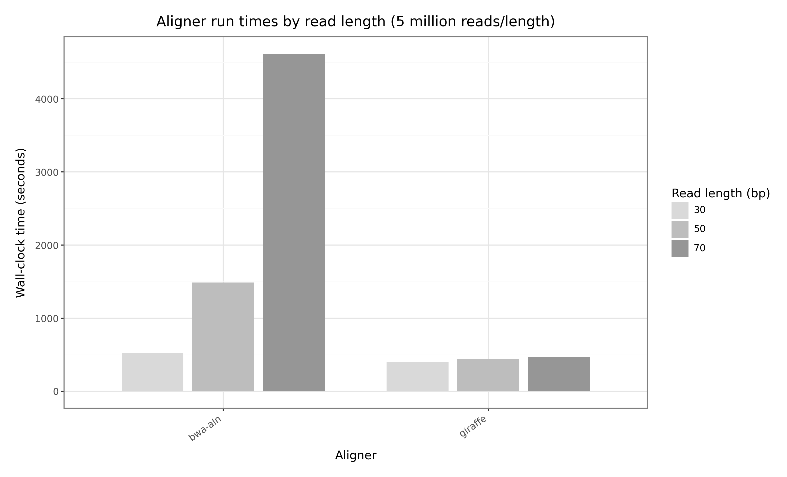
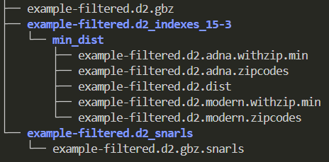
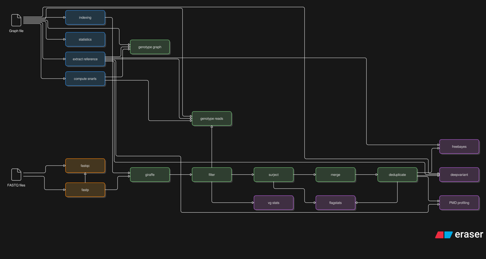

[](https://pixi.sh)


<p align="center">
  
</p>

<div align="center"><strong>Graph Variant Explorer: Pangenomic analysis of ancient or modern DNA</strong></div><br>

[](https://codespaces.new/NBISweden/grave)

## Brief description

`grave` is a Nextflow workflow for aligning, genotyping, and variant calling ancient or modern short-reads against a pangenome graph. A simplified summary of workflow steps is found [here](#workflow-dag). A Wiki with further detail is available [here](https://github.com/NBISweden/grave/wiki).

Typically, the inputs to `grave` are a pangenome graph in `.gbz` format and a `.csv` samplesheet specifying `FASTQ` files (paired-end or merged/single-end).

>[!NOTE]
>To compare the outcomes of graph versus linear reference-based alignment methods, `grave` can also be run in [linear mode](#linear-reference-mode), taking a `FASTA` assembly instead of a graph.

Workflow outputs are described [here](#workflow-outputs).

More information on genotyping and variant calling is found [here](#genotyping-and-variant-calling).

It is recommended to construct the graph with [Minigraph-Cactus](https://github.com/ComparativeGenomicsToolkit/cactus/blob/master/doc/pangenome.md). Before doing so, read this [section](#generate-or-provide-a-reference).

## Quick start

### Local or HPC installation

1. [Install Pixi](https://pixi.sh/latest/installation/): `curl -fsSL https://pixi.sh/install.sh | sh`
2. Clone the Workflow repository: `git clone https://github.com/NBISweden/grave.git`
3. Run `cd grave && pixi install`

>[!NOTE]
>The pixi project contains two environments:<br><br>
>`default`: installed with `pixi install`. This lacks apptainer (e.g. for systems with an existing Apptainer installation).<br><br>
>`apptainer`: installed with `pixi install -e apptainer`. This provides an Apptainer installation.

<details>

<summary><h3>Information on pixi usage (drop down)</h3></summary>

- At minimum, `grave` can be run with `Nextflow` and either `Apptainer`, `Singularity`, or `Docker` installed in `$PATH`
- However, it is recommended to run it via `pixi`
- `pixi` is a drop-in replacement for `conda`, and `grave` uses it to install its basic dependencies.
- `pixi` environments have an editable manifest file, the `pixi.toml`
- Solved environments also have a `pixi.lock` file, which fixes the versions of all dependencies including transitive ones. The lockfile in this repository represents an environment that has been tested on Linux systems.
- Installed `pixi` environments are found in the hidden folder `.pixi/envs`
- `pixi` will automatically install an environment it lacks, if implied by another command (e.g., `pixi run -e apptainer ...` will install the `apptainer` environment if it is not found).
- You can run commands in a `pixi` environment by prefixing them with `pixi run` (or in a specific environment with `pixi run -e <environment>`).
- Alternatively you can enter a software environment with `pixi shell` (or a specific environment with `pixi shell -e <environment>`), similar to `conda activate <environment>`
- To delete an environment: `rm -rf .pixi/envs/<environment_name>`

</details>

### Run grave with the bundled test data

- To run a test with provided data: `pixi run test-apptainer`

- Or using Docker: `pixi run test-docker`

>[!TIP]
> All `pixi run` commands use the `default` environment. To specify the `apptainer` environment:<br><br>
>`pixi run -e apptainer test-apptainer`

### Running grave with your own data

### Step 1 of 2: Preparing the input files

#### Generate or provide a reference

- `grave` accepts three types of reference: `filtered_graph`, `unfiltered_graph`, or `linear` (i.e., FASTA assembly).

- Graphs should be in `.gbz` format, such as those produced by [Minigraph-Cactus](https://github.com/ComparativeGenomicsToolkit/cactus/blob/master/doc/pangenome.md), a workflow within the [Cactus package](https://github.com/ComparativeGenomicsToolkit/cactus). Graph indexes are not required - `grave` will create the necessary indexes for ancient and/or modern input samples.

- When using `Minigraph-Cactus` for graph construction, keep input assembly contig headers simple ([see the official guidance here](https://github.com/ComparativeGenomicsToolkit/cactus/blob/master/doc/pangenome.md#contig-names)), and without special characters.

##### Filtered graphs

- A filtered graph is one with depth filtering applied, i.e., nodes not represented in at least *`depth`* haplotypes are removed from the graph. Typically this is set to around 10% of the number of haplotypes (i.e., `40 pseudohaploid assemblies` or `20 phased assemblies` -> `depth 4`).

- The `MiniGraph-Cactus` option `--giraffe` generates a graph filtered to depth 2. Depth is adjusted with the `--filter` parameter, e.g.: `--giraffe --filter 10`

- The resulting graph can be provided to `grave` with `--reference graph.d10.gbz --reference_type filtered_graph`

- The cost of depth filtering is that rarer variants are lost from the graph. This should be considered when users are building a graph from relatively divergent assemblies, or when some constituent species have fewer haplotypes than others (e.g., an outgroup has a single haplotype, while the ingroup has many).

> [!IMPORTANT]
>- For samples with high coverage (e.g., 20X) and high purity in terms of endogenous content, the current best practice is to use an [unfiltered graph](#unfiltered-graphs). With this approach, *K*-mers from the reads are used to sample representative haplotypes from the graph, and reads are aligned to the subset.
>- For samples with degraded, short, and low coverage endogenous content, plus high levels of contamination, **filtered graphs are likely to be preferable**, as we expect the *K*-mer-based subsampling to underperform.

##### Unfiltered graphs

- Running in unfiltered graph mode utilises *K*-mer profiling of the reads to sample representative haplotypes from the graph for mapping, read more [here](https://www.nature.com/articles/s41592-024-02407-2) and [here](https://github.com/vgteam/vg/wiki/Haplotype-Sampling).

> [!IMPORTANT]
> See the above section, users should consider (or test) whether an unfiltered graph is appropriate for their samples.

- To build an unfiltered graph, run `MiniGraph-Cactus` with option: `--haplo` (`--giraffe` is not required).

- The clipped, unfiltered graph can be provided to `grave` with `--reference graph.gbz --reference_type unfiltered_graph`

#### Fill out the samplesheet

Complete a `samplesheet.csv` file, detailing file system paths to your reads. The layout is shown below:

>[!TIP]
> The table below is an example. The file provided to `grave` must be in `.csv` format

| sample_id     | library_id | repeat_number | sample_type | merged | fastq1                | fastq2               |
|---------------|------------|---------------|-------------|--------|-----------------------|----------------------|
| ancientHuman1 |      1     |      1        |   ancient   | false  | /path/to/read1.fq.gz  | /path/to/read2.fq.gz |
| ancientHuman1 |      1     |      2        |   ancient   | false  | /path/to/read1.fq.gz  | /path/to/read2.fq.gz |
| ancientHuman1 |      2     |      1        |   ancient   | false  | /path/to/read1.fq.gz  | /path/to/read2.fq.gz |
| modernHuman7  |      1     |      1        |   modern    | false  | /path/to/read1.fq.gz  | /path/to/read2.fq.gz |
| mergedInput   |      1     |      1        |   ancient   | true   | /path/to/merged.fq.gz |                      |

- `sample_id`: unique sample identifier

- `library_id`: unique library identifier

- `repeat_number`: repeat number of the library

- `sample_type`: sample is ancient or modern - **Note:** _this affects how the sample will be processed_

- `merged`: whether the reads have already been merged (e.g., some ancient samples)

- `fastq1`: relative or absolute path to the first FASTQ

- `fastq2`: relative or absolute path to the second FASTQ

#### Customise run parameters

- While in many cases defaults are sufficient, custom parameters can be set by editing a `params.yml` file, and providing it on the command line when you execute the workflow (`-params-file params.yml`).

- Use `pixi run help` to see available parameters and their descriptions.

- An important parameter is `--steps`, a string specifying which pipeline stages to run, e.g., (`--steps 'index,preprocess'` only indexes the input and preprocesses the reads). Some steps have their own dependencies, but `grave` will notify the user immediately when an invalid combination is provided. The default is to run all possible steps for a typical graph reference.

- A selection of key parameters are expanded on below.

##### Graph indexing

> [!IMPORTANT]
> The graph aligner `vg giraffe` uses a seed, cluster, chain, and extend strategy, with two important parameters: *K*-mer length (`k`) and window length (`w`). During graph indexing, minimisers are calculated from haplotype paths, by sliding across length `w` and taking the sequence (minimiser) of length `k` with the smallest hash value. The seeding stage of alignment involves computing exact matches between these minimisers and reads. Proximate seeds in the graph are clustered, clusters are chained together, and high-scoring chains serve as the starting point for extension.<br><br>
> Users should keep in mind that reads shorter than `k+w-1` cannot be aligned, as they are too short for minimiser computation. Furthermore, with very short reads (~30 bp) users may notice fewer high quality alignments (MAPQ 30+) - this is expected if there are many comparably scoring chains entering extension, thus many comparably scoring mapping positions for a read.<br><br>
> To address these issues, `grave` uses different `k` and `w` defaults for modern and ancient reads:<br><br>
> Modern samples are run with `giraffe` defaults, emphasising higher specificity (`k` = 29, `w` = 11).<br><br>
> For aDNA reads, a reduced `k` and `w` results in a low-specificity, high-density index - relying on chaining to discriminate good matches from spurious ones. The `grave` aDNA defaults (`k` = 15, `w` = 3) balance performance across 30-70 bp reads, though a MAPQ filter of `30` is recommended to filter out alignments from contaminants. Users may find that adjusting these parameters for their particular dataset can improve performance, see the table below for general guidance.<br><br>
> Suggested further reading: [Rubin et al., 2025, NAR Genomics and Bioinformatics](https://academic.oup.com/nargab/article/7/4/lqaf170/8376687). As the authors note, there is no single best setting for `k` and `w` in the aDNA context, as it depends on several factors related to the graph and reads.

**Comparison of alignment parameters**<br>

| Alignment&nbsp;tool | \|--- | Accurate| reads&nbsp;per | million | ---\| | \|--- | Inaccurate | reads&nbsp;per  | million | ---\| |
| :-:                                |  :-:        | :-:         | :-:         | :-:         | :-:         | :-:   | :-:   | :-:   | :-:   | :-:   |
| *Read length*\*                    | *30*        | *40*        | *50*        | *60*        | *70*        | *30*  | *40*  | *50*  | *60*  | *70*  |
| `grave`:&nbsp;`k-13/w-3`               | 516,840     | **660,570** | 749,380     | 797,680     | 831,130     | 2,980 | 4,430 | 4,270 | 4,160 | 5,290 |
| `grave`:&nbsp;`k-15/w-3`               | 459,420     | 654,470     | **754,550** | 803,160     | 837,050     | 2,790 | 4,420 | 4,910 | 3,980 | 4,840 |
| `grave`:&nbsp;`k-15/w-5`               | 354,410     | 627,050     | 744,380     | 797,360     | 831,850     | 3,330 | 4,610 | 4,970 | 4,150 | 5,040 |
| `grave`:&nbsp;`k-19/w-3`               | 396,080     | 603,760     | 740,410     | **805,890** | **841,830** | 6,910 | 4,600 | 5,150 | 4,500 | 4,910 |
| `grave`:&nbsp;`k-19/w-5`               | 410,240     | 578,510     | 724,250     | 797,790     | 836,140     | 8,750 | 5,350 | 5,250 | 4,830 | 5,000 |
| `bwa aln: -l 16500 -n 0.01 -o 2`** | **558,200** | 560,550     | 654,450     | 684,310     | 740,200     | 6,910 | 2,830 | 3,470 | 3,160 | 3,950 |

\*~100k read pairs were generated per fragment length with `NGSNGS` from a related assembly not present in the benchmarking graph (sheep). Unmapped reads were removed and MAPQ 30 was applied.

\*\*The bwa linear reference was the same used as the graph backbone (GCF_016772045.2).

**Comparison of alignment run time**<br>



- 5 million reads per length were aligned using 48 CPUs
- `bwa aln` targeted the sheep linear reference genome
- `giraffe` targeted a sheep pangenome graph, and used the `grave` default indexing settings (`k` = 15, `w` = 3)

##### GPU accelerated graph alignment with parabricks

- [NVIDIA Parabricks](https://docs.nvidia.com/clara/parabricks/latest/index.html) offers GPU-accelerated versions of a number of popular genomics tools, including `vg giraffe`
- This is an experimental feature in `grave` selected with `--gpu_giraffe` and using the `gpu` profile
- The default resource request is for 1 GPU. To specify GPU number and/or type, a config file can be provided on the command-line, e.g.:

```
nextflow main.nf -profile gpu,<institution> -params-file params.yml -c gpu_configuration.config
```

```{gpu_configuration.config}
process {
    withName: 'GPU_GIRAFFE' {
        accelerator = [ type: 'h100', request: 2 ] // 2x h100 GPUs
    }
}
```

> [!IMPORTANT]
> **Limitations**:<br>
> - Only NVIDIA GPUs are supported, and the institutional config must be configured for GPU requests.<br>
> - `Parabricks` updates less frequently than `vg`, thus outputs between the implemented versions may not be identical.<br>
> - Some graph indexes are not compatible between the two tools and must be recomputed, due to underlying `vg` version differences.<br>
> - `Parabricks 4.7.1` surjects directly to BAM, disabling genotyping with `vg call`, which uses GAM.<br>
> - `Parabricks 4.7.1` does not support custom alignment scoring, such as mismatches/gap opens/gap extensions.<br>
> - `grave` does not support GPU-accelerated `giraffe` for multi-reference graphs. Please request it if you need it.<br>

#### Was your graph built with more than one reference sample?

- `Minigraph-Cactus` requires at least one [reference sample](https://github.com/ComparativeGenomicsToolkit/cactus/blob/master/doc/pangenome.md#Reference-Sample), usually the most contiguous reference assembly, e.g.: `cactus-pangenome --reference GRCh38`

- If your graph has a single reference sample, you can skip this section.

- Paths through the reference sample are called _reference paths_. Unless configured otherwise, `grave` will assume __a single reference sample__, and use rational defaults that assume the same, for example `surject` will transform GAM alignments to linear BAM relative to __all reference paths__ in the graph. If there is more than one reference sample in the graph, this will cause undesirable outputs in certain steps, and errors in others.

- Therefore, if your graph was built with multiple reference samples, e.g.: `cactus-pangenome --reference GRCh38 chimp gorilla`, it is required to run `grave` with `--multiple_references`, and to provide one or more `.paths` files.

- Each `.paths` file contains a list of the reference paths in one reference sample, with one path name per line.

- __The name of the `.paths` file matters__: the prefix must match a reference sample name provided in the `seqFile` of `Minigraph-Cactus`, and the suffix must be `.paths`, e.g.: `GRCh38.paths`, `chimp.paths`, and `gorilla.paths`

>[!TIP]
> `vg` is packaged in the pixi environment, to see the reference samples in your graph run: `pixi run vg paths --reference-paths --metadata -x myGraph.gbz | cut -f3 | tail -n+2 | sort | uniq`<br><br>
> For a list of all reference path names from, for example GRCh38, run: `pixi run vg paths --reference-paths --metadata -x myGraph.gbz | tail -n+2 | awk '$3 == "GRCh38"' | cut -f1 > GRCh38.paths`

- For each `.paths` file provided, `grave` will run pipeline steps relative to that sample separately from the others, e.g., `surject` will produce a separate `.bam` file per reference sample, such that surjecting `unknownSimian.1.gam` to `chimp.paths` and `gorilla.paths` will produce:

```
unknownSimian.1.chimp.bam
unknownSimian.1.gorilla.bam
```

### Step 2 of 2: Running grave

> Example of how to run a local test (not recommended for production runs)

`pixi run -e apptainer nextflow main.nf -profile apptainer,test -params-file params.yml`

> Running at scale (e.g., on SLURM cluster)

- It is usually good practice to run `grave` via a `tmux` or `screen` session rather than directly on the login node. An editable shell script that will do this for you is available in `bin/slurm_submission.sh`

- Institutional profiles are available via `nf-core` for many major HPC centres, see [here](https://nf-co.re/configs/). The example command below configures `grave` for the Dardel cluster in Stockholm, Sweden.

- When running on a cluster using the `slurm` job scheduler, ensure you provide a project allocation number using the `--project` parameter. This can be on the command line or via the `params.yml` file.

`pixi run nextflow main.nf -profile pdc_kth -params-file params.yml --project example-allocation-12345`

## Workflow outputs

>[!TIP]
> By default results are stored in the `results` directory. Exact outputs depend on the settings used

| Output directory      | Description                                                                                                               |
|-----------------------|---------------------------------------------------------------------------------------------------------------------------|
| 01_pipeline_info      | Package versions, run parameters, and Nextflow trace reports (if set)                                                     |
| 02_reference          | Reference statistics and reference FASTA files extracted from graphs with Pan-SN headers + index                          |
| 03_read_qc            | Read QC reports                                                                                                           |
| 04_mapped_reads       | Mapped reads (library level GAM/BAM, surjected/merged/deduplicated BAM, alignment statistics, failed samples)             |
| 05_post_mortem_damage | Post-mortem damage profiles (only for samples with the `ancient` metadata tag)                                            |
| 06_genotyping         | Genotyping outputs directly from the graph, and per sample                                                                |
| 07_variant_calling    | Variant calling outputs per sample                                                                                        |

>[!TIP]
> The workflow also computes graph indexes and snarls, stored in folders alongside the input graph (detected on repeat runs)



## Genotyping and variant calling

>[!TIP]
> `grave` outputs BAM files surjected to reference assemblies in the graph, therefore users can use these in custom downstream tools

### Provided genotyping tools

#### vg deconstruct

- `vg deconstruct` produces a VCF file with a line for every snarl (bubble) in the graph. Allele information (reference vs alt) is taken from paths in the graph, read more [here](https://github.com/vgteam/vg/wiki/VCF-export-with-vg-deconstruct).

#### vg call

- `vg call` genotypes graph variants present in each mapped sample (i.e., no novel variant calling), read more [here](https://github.com/vgteam/vg/wiki/SV-Genotyping-and-variant-calling#genotyping-a-VCF-using-the-graph).
- It takes GAM files as input, and therefore users should note that no deduplication is done prior to genotyping, see [here](https://github.com/vgteam/vg/issues/3283).

### Provided variant calling tools

#### Freebayes

- `Freebayes` is integrated in `grave`, read more [here](https://github.com/freebayes/freebayes).

#### DeepVariant

- `DeepVariant` is integrated in `grave` (currently recommended for human input data only), read more [here](https://github.com/google/deepvariant).

## Linear reference mode

- `grave` can be run in linear reference mode, mapping reads against a single FASTA reference instead of a graph.

- Ancient DNA alignment will be run with `BWA aln` (`-l 16500 -n 0.01 -o 2`) and modern DNA with `BWA MEM` (default settings).

- To configure linear mode, set the parameter `reference_type` to `linear`, and provide a FASTA reference with the `reference` parameter.

## Workflow DAG


